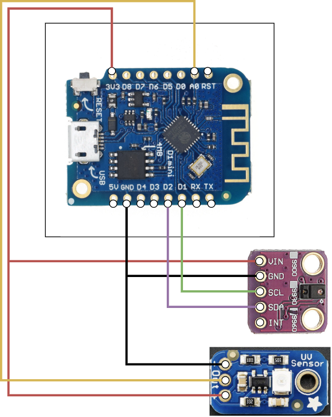

# arduino projects
Arduino hobby projects

## Installing the temprature sensor

Tutorial for the [BME280 temprature, pressure and humity sensor](https://lastminuteengineers.com/bme280-arduino-tutorial/)

